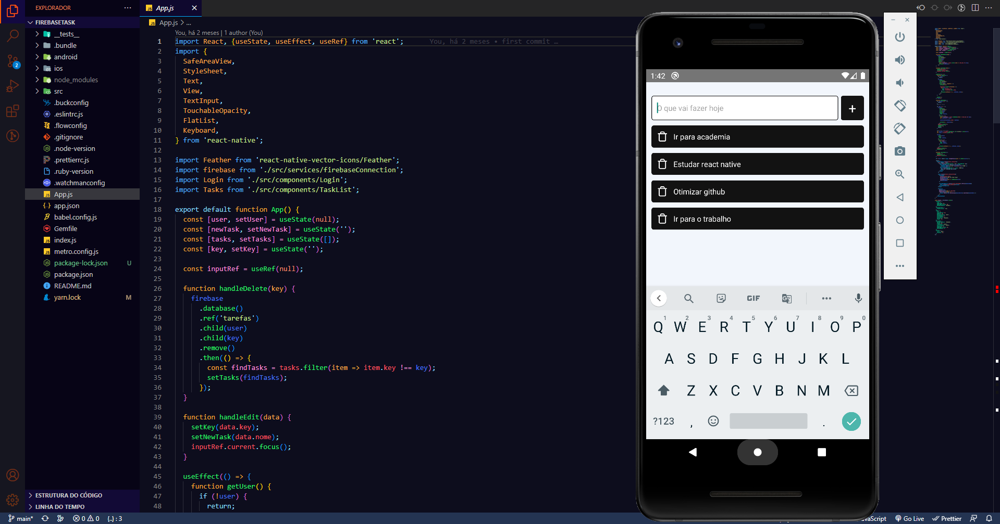

# Firebase task com React Native

  

## Objetivo:

### Criar um aplicativo completo para gestão de tarefas usando firebase.

## Descrição:

- `Criação de novos usuários e login.`
- `Possibilidade de editar tarefa.`
- `Opção de excluir a tarefa quando for concluida`
- `Armazenamento no local storage possibilitando o usuário fechar o app sem perder as tarefas.`

## <i>Douglas Monteiro</i> 😁🔥🚀
